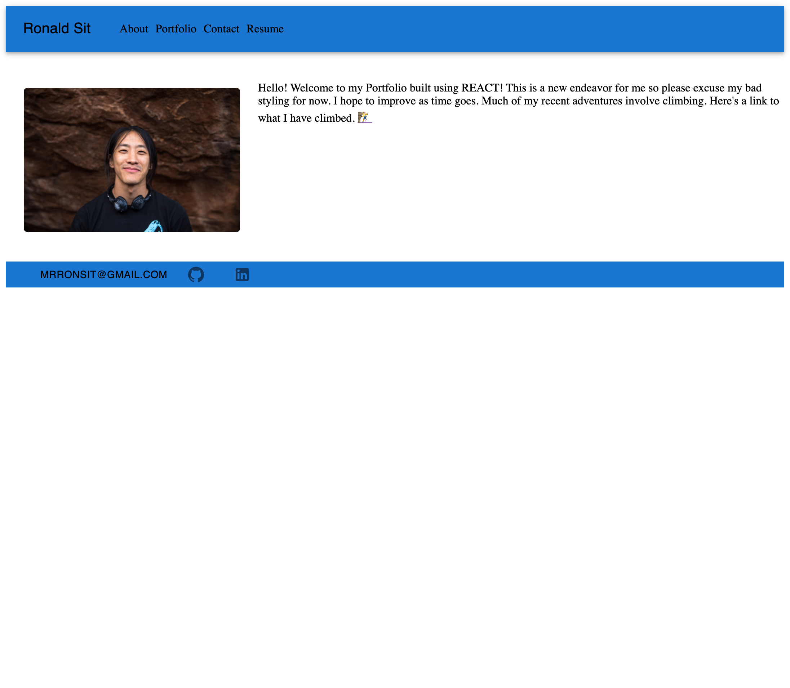
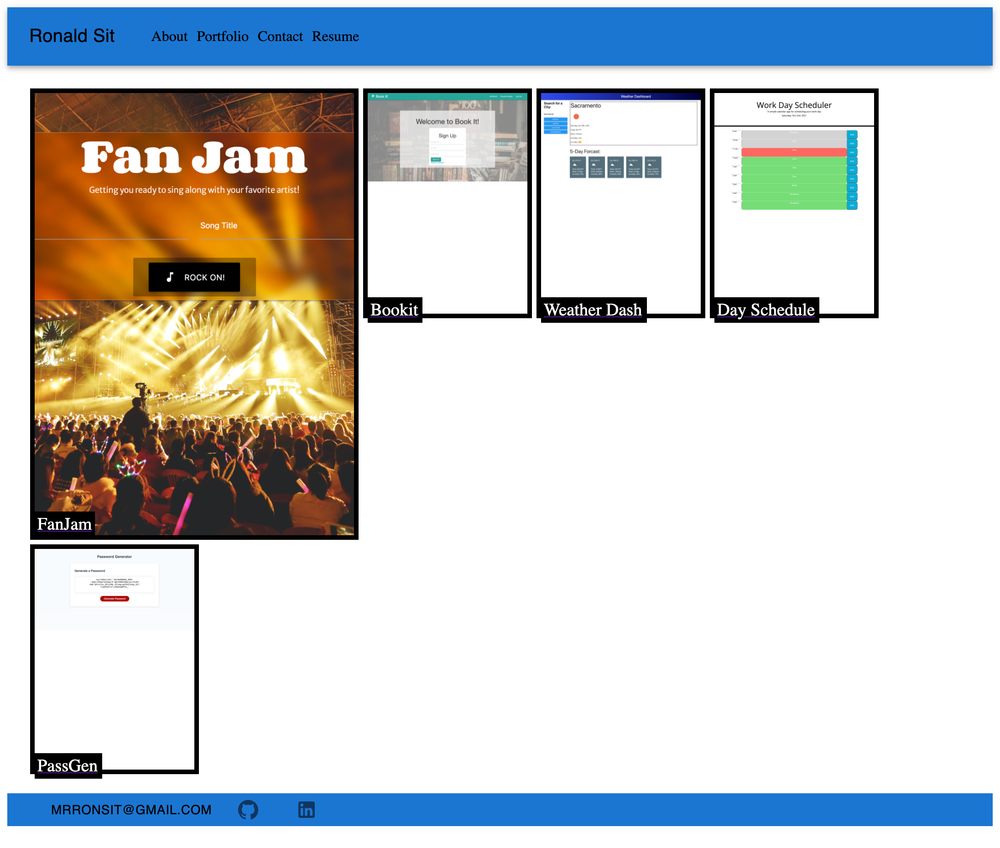

# Portfolio-REACT-RS

## Description
First use of REACT JS to build a portfolio. Wanted to understand the basics of building compenents to create a front-end only site. Will definitely keep working on this as I understand REACT better.

## Table of Contents
- [Usage](#usage)
- [Deployment](#deployment)
- [Credits](#credits)
- [License](#license)
- [Tests](#tests)
- [Qustions](#questions)

## Usage
Use the button/links in the footer and header to navigate through the single HTML page.

## Deployment
[Link to deployed website](https://xenodochial-elion-e786f4.netlify.app/#about)

## Credits
Collaborators that helped with this project: N/A

## License
This project is covered under an MIT license. More information can be found here: https://opensource.org/licenses/MIT

## Tests
N/A

## Questions
If you have any questions, feel free to email <mrronsit@gmail.com> or feel free to peruse my [Github](https://github.com/sitmeister)!
